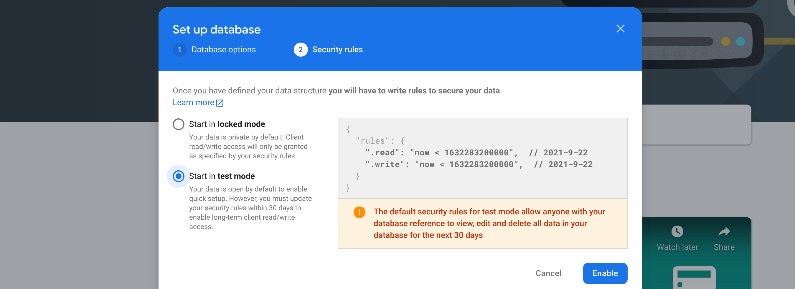

# Dolby.io Classroom App

This application demonstrates an educational classroom application.

- uses the [Dolby.io](https://dolby.io) Communications SDK for JavaScript
- uses Firebase Real-time Database
- bootstrapped with Create React App

You can learn more at https://docs.dolby.io/communications-apis/docs

# Clone the Repository

Run the following to clone the repository:
```sh
git clone https://github.com/dolbyio-samples/meet-dolbyio-classroom.git
cd meet-dolbyio-classroom
```

# Set Credentials

## Dolby.io Setup

Dolby.io credentials are defined in `src/utils/voxeetUtils.js`.

Find your **Consumer Key** and **Consumer Secret** by following these steps:

1. Select the `SIGN IN` link located in the upper right corner of the Dolby.io page. Log in using your email and password.
2. Click the `DASHBOARD` link visible in the upper right corner of the website.
3. Select your application from the `APPLICATIONS` category located on the left side menu.
4. Select the `API Keys` category from the drop-down menu visible under your application.
5. In the `Communications APIs` section, you can access your `Consumer Key` and `Consumer Secret`.

Enter your Dolby.io Credentials in `/src/utils/voxeetUtils.js`. That is, replace the placeholder text in:
```js
const consumerKey = '<DOLBYIO_COMMUNICATIONS_API>';
const consumerSecret = '<DOLBYIO_COMMUNICATIONS_SECRET>';
```
with the credentials from your application, found [here](https://dolby.io/signin).
Note the initialization method shown here is suitable for localhost testing only, please refer to our documentation for [initialization](https://docs.dolby.io/communications-apis/docs/initializing-javascript) best practices.    

## Firebase Setup

Firebase credentials are defined in `src/providers/Firebase.js`.

1. Log into the [Firebase Console](https://console.firebase.google.com/) and click "Create a Project.".  Give the project a name such as "dolbyio-classroom-demo".  Accept the terms and click "Continue".
2. We recommend unselecting Google Analytics while in development, then click "Continue".
3. Click the "</>" icon to add a Web App (image below). Give your app a name such as "classroom-demo" and click "Register app".  You do not need Firebase Hosting at this point.


4. Copy the details provided in `firebaseConfig` on this screen and paste them into the `src/providers/Firebase.js` file.

Essential you can replace the entire object:
```
const firebaseConfig = {
  apiKey: "<API_KEY>",
  authDomain: "<PROJECT_ID>.firebaseapp.com",
  databaseURL: "<DATABASE_ID>.firebaseio.com",
  projectId: "<PROJECT_ID>",
  storageBucket: "<BUCKET>.appspot.com",
  messagingSenderId: "<MESSAGING_SENDER_ID>",
  appId: "<APP_ID>",
  measurementId: "<MEASUREMENT_ID>"
};
```
With your config object that you copied from the Firebase console.

* If you try running the app at this point, you'll get an error that looks like this: `@firebase/database: FIREBASE WARNING: Firebase error. Please ensure that you spelled the name of your Firebase correctly`. This is because we have not set up the Realtime database yet.

## Firebase Real-Time Database Setup

1. Continue to the Console and click "Build" and then "Realtime Database".


2. Click "Create Database". Click "Next" and accept the default setting.

3. Click "Start in test mode", then click "Enable."



Now the app should connect to Firebase.

## Data Model

For the Classroom App, the data model in Firebase looks like this:

* There are Firebase objects for each meeting room, the room id (cell) creates the key to the object in the Realtime Database
* Inside each meeting room key object there are two properties of note:
  * `classRoom` (object) contains information about all of the **student** seats
    * Inside each seat is
      * `isCalledOn` (boolean)
      * `isHandRaised` (boolean)
      * `name` (string)
      * `participantId` (string | `false`)
  * `teacherId` (string | `false`) contains the participant ID of the teacher, if the room has no teacher, this value is `false`

# Running the Application

After all credentials are set, you can run with:

```js
npm install
npm run start
```

You should then be able to view the app locally on the development
server.
